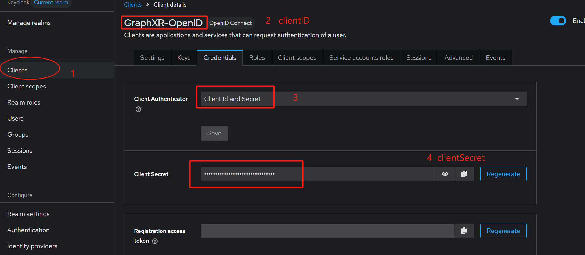

# Keycloak Integration Guide (v26.2.0)

This guide demonstrates how to integrate Keycloak with GraphXR using different authentication methods.

## Prerequisites

- Start the Keycloak with "bash ./run.sh" (You must install Docker)
- Keycloak server running on `http://localhost:8080`
- Default credentials: admin/admin

> To start Keycloak, use the command **./run.sh**.  
> You can directly import **GraphXR-iframe-demo.json** and **GraphXR-OpenID.json** into Keycloak under the "Clients" section.

## 1. User Management

### Creating Users

1. Navigate to the users page: [http://localhost:8080/admin/master/console/#/master/users](http://localhost:8080/admin/master/console/#/master/users)
2. Create the following example users:

- Email: demo@demo.com | Password: demo@demo.com
- Email: example@example.com | Password: demo@demo.com

## 2. OpenID Connect Integration

### 2.1 Create OpenID Client

1. Navigate to: [http://localhost:8080/admin/master/console/#/master/clients/add-client](http://localhost:8080/admin/master/console/#/master/clients/add-client)
2. Configure basic settings:

```
Client Type: OpenID Connect
Client ID: GraphXR-OpenID
Name: GraphXR OpenID
Description: OpenID Demo
```

3. Configure capability settings:
   

4. Configure access settings:

```
Root URL: https://localhost:9000
Home URL: https://localhost:9000/oauth2/login
Valid redirect URLs: http://localhost:9000/oauth2/login/callback
Valid post logout redirect URIs: https://localhost:9000/oauth2/logout
Web origins: https://localhost:9000
```

### 2.2 Configure GraphXR

1. Retrieve OpenID configuration: [http://localhost:8080/realms/master/.well-known/openid-configuration](http://localhost:8080/realms/master/.well-known/openid-configuration)
2. Add the following to GraphXR's `config.js`:

```javascript
oauth2: {
  loginShowName: "Keycloak",
  authorizationURL: 'http://localhost:8080/realms/master/protocol/openid-connect/auth',
  tokenURL: 'http://localhost:8080/realms/master/protocol/openid-connect/token',
  userProfileURL: "http://localhost:8080/realms/master/protocol/openid-connect/userinfo",
  clientID: "GraphXR-OpenID",
  clientSecret: "{YOUR_CLIENT_SECRET}",
  scope: 'openid,email,profile',
  callbackURL: "http://localhost:9000/oauth2/login/callback",
  profileMapping: {
   firstName: "family_name",
   lastName: "given_name",
   email: "email",
  },
},
```

3. Replace `{YOUR_CLIENT_SECRET}` with the actual client secret:
   

## 3. SAML Integration

### 3.1 Create SAML Client

1. Navigate to: [http://localhost:8080/admin/master/console/#/master/clients/add-client](http://localhost:8080/admin/master/console/#/master/clients/add-client)
2. Configure basic settings:

```
Client Type: SAML
Client ID: GraphXR-SAML
Name: GraphXR SAML Demo
Description: SAML Demo
```

3. Click "Save" and configure access settings:

```
Root URL: https://localhost:9000
Home URL: https://localhost:9000/saml/login
Valid redirect URLs: https://localhost:9000/*
Valid post logout redirect URIs: https://localhost:9000/saml/logout
IDP-Initiated SSO URL name: GraphXR-SAML
Master SAML Processing URL: https://localhost:9000/saml/login/callback
Name ID format: email
```

4. Add mappers under "Client scopes" > "GraphXR-SAML-dedicated" > "Add mapper":

- email
- firstName
- lastName

### 3.2 Configure GraphXR for SAML

1. Retrieve the SAML descriptor: [http://localhost:8080/realms/master/protocol/saml/descriptor](http://localhost:8080/realms/master/protocol/saml/descriptor)
2. Copy the "ds:X509Certificate" value
3. Add the following to GraphXR's `config.js`:

```javascript
saml: {
  path: "https://localhost:9000/saml/login",
  entryPoint: "http://localhost:8080/realms/master/protocol/saml/clients/GraphXR-SAML",
  cert: `MIICmzCCAYMCBgGFDA5DDTANBgkqhkiG9w0BAQsFADARMQ8wDQYDVQQDDAZtYXN0ZXIwHhcNMjIxMjEzMTUxMzU5WhcNMzIxMjEzMTUxNTM5WjARMQ8wDQYDVQQDDAZtYXN0ZXIwggEiMA0GCSqGSIb3DQEBAQUAA4IBDwAwggEKAoIBAQDnz+t3ZAT+NYbdHOoyybDLHX+wMpaURIyoU9szjNMKQnrcz2a0YYgK90shUrHfnDQAu2KQWvBvXlskwlCsuHt11E/R4s3v/E/qWu2GIe5d/2qWS4BRXuCSudQ6LhOB+3EWFhG+AMakW2xt9tO27RvtsAKlpFh/ABfFc/jDa0bRPfducbCnn7wnzwPfLaz3EFCmj07HlP69CSfqTn+hxshO075WoiFNSAAihmMQnA/q+Ec7QRKJNIMAkRvdM/iW53mYV8bYf7HqhbaMz9Go01s7mbnc75+7lJHBLy5iRnRJKjGUu+VwJ0Fh0jeVgpyaD8H4TfWxzaycxTN31aFEEqKTAgMBAAEwDQYJKoZIhvcNAQELBQADggEBAEcDOhuyrPZrej77Wus7QzClRwC8E+1p9RNz2wV/rlyvkAgaqGG4n22x3v5tdPjziFIzu5mJX92S/JnPTuYcII01jryq44saqvJrVBhWHbUsQDcJwRZ+ccA4Ri56ZXMmrfcyrg/qBmtvw1e8Yj4EisK1Y3+BhwHF2yLbJJGlwwvcL/ZHXN94o0ra6JqPnYaGOjCs5864KJnLWuFtKBlu+fRnVb9PUS7SDJ1Pu1mcwoH02QrF7yVRfkA32ciZbTusNK2qfLx8/8HeveP9p+uywCP3hx+9rzBZhyTItFPgC/JJLGMzxQsX7t7EWAxNV7yQ23VhULWSCLLiwRrXhMMZDDE=`,
  profileMapping: {
   email: "nameID",
   firstName: "firstName",
   lastName: "lastName"
  }
},
```

## 4. iframe Authentication

> refer ./index.js

### 4.1 Configure iframe Auth

Add the following to GraphXR's `config.js`:

```javascript
iframeAuth: {
  keyName: "token",
  userProfileURL: "http://localhost:8080/realms/master/protocol/openid-connect/userinfo",
  profileMapping: {
   email: "email",
   firstName: "family_name",
   lastName: "given_name",
  }
},
```

### 4.2 Run the Demo App

1. Start the demo application:

```bash
yarn && yarn start
```

2. Access the demo at: [http://localhost:3080](http://localhost:3080)

### 5 test the userInfo API

> Your need sure the follow the api return {email:"YourEmail"}

```
let token = "YourToken";
let email = "YourEmail";
let userInfoApi = "http://localhost:8080/realms/master/protocol/openid-connect/userinfo";
fetch(userInfoApi, {
  method: "GET",
  headers: {
    Accept: "application/json, text/plain, */*",
    "Content-Type": "application/json",
    Authorization: `Bearer ${token}`,
    Email: `${email}`,
  },
})
  .then((res) => {
    return res.json();
  })
  .then((res) => console.log(res));

```
